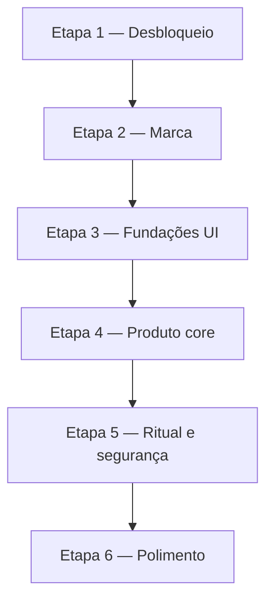

# Plano de execução do backlog

Plano derivado de [`backlog.md`](../backlog.md) na raiz do repositório.  
**12 tarefas** organizadas em **6 etapas**, respeitando dependências técnicas e minimizando retrabalho.

> Executar na ordem das etapas. Dentro de cada etapa, seguir a ordem listada salvo quando indicado paralelismo.

---

## Visão geral

| Etapa | Foco | Tarefas | Entrega principal |
|-------|------|---------|-------------------|
| **1** | Desbloqueio | 1 | Convites funcionam ponta a ponta |
| **2** | Marca | 2 | Auth com identidade visual correta |
| **3** | Fundações UI | 3 | Modos distintos, estrelas, criação reutilizável |
| **4** | Produto core | 2 | Caixinhas no Experiences + sugestões |
| **5** | Ritual e segurança | 2 | Sorteio anônimo + sessão EB limitada |
| **6** | Polimento | 2 | Navegação e cards da lista refinados |



---

## Ordem linear (sequencial)

Use esta ordem quando houver um único executor (humano ou agente):

1. Corrigir fluxo de aceite de convite pós-autenticação
2. Integrar logos oficiais no aplicativo
3. Centralizar wordmark no topo da tela de autenticação
4. Diferenciar sessão individual e sessão em grupo na interface
5. Representar parâmetros com estrelas na criação e na carta de sorteio
6. Refazer tela de criação de caixinhas
7. Permitir criar caixinhas no modo Experiences
8. Implementar banco centralizado de sugestões de experiências
9. Ocultar autoria na revelação do sorteio
10. Limitar sessão do Experience Box por tempo e sorteios
11. Melhorar botões de navegação secundária (Voltar, Sair e afins)
12. Redesenhar cards de experiência na lista do modo Experiences

---

## Etapa 1 — Desbloqueio crítico

### Tarefa 1.1 — Corrigir fluxo de aceite de convite pós-autenticação

**Objetivo:** código ou deep link → prévia → autenticação (se necessário) → aceite → grupo acessível.

**Checklist de arquivos:**

| Arquivo | Ação esperada |
|---------|---------------|
| `client/src/presentation/invite/InvitePreviewPage.tsx` | Retomar fluxo pós-auth; CTAs corretos |
| `client/src/presentation/auth/AuthPage.tsx` | Preservar `returnTo` em login e cadastro |
| `client/src/app/routes.tsx` | Rotas `/join`, `/auth` coerentes |
| `client/src/app/routeGuards.tsx` | `RequireGuestRoute` não redireciona antes do aceite |
| `client/src/app/useInviteDeepLink.ts` | Deep links honram mesmo fluxo |
| `client/src/app/useBootstrapFlow.ts` | Bootstrap com convite pendente |
| `client/src/domain/invite/` | Pendência de convite (domínio ou adapter) |
| `client/src/app/SessionProvider.tsx` | Race de hidratação de sessão |
| `client/src/i18n/locales/*.json` | `invite.*`, `auth.*` |
| Testes: `invitePresentation.test.ts` (ou equivalente) | Persistência e navegação pós-auth |

**Validação (M1 — Onboarding de grupo):**

- [ ] Código na auth → prévia → login → grupo sem passos mortos
- [ ] Deep link `?code=` / `?t=` → mesmo resultado
- [ ] Cadastro a partir da prévia conclui aceite
- [ ] Usuário já logado aceita com um toque
- [ ] Sem regressão em login Experience Box e registro sem convite

---

## Etapa 2 — Marca e primeira impressão

### Tarefa 2.1 — Integrar logos oficiais no aplicativo

**Depende de:** Etapa 1 concluída (recomendado, não obrigatório).

**Checklist de arquivos:**

| Arquivo | Ação esperada |
|---------|---------------|
| `assets/logo-icon.*` | Asset quadrado (time de produto) |
| `assets/logo-wordmark.*` | Asset retangular (time de produto) |
| `assets/README` ou `.gitkeep` | Documentar nomes esperados |
| `client/src/presentation/components/BrandMark.tsx` | Variantes `icon` e `wordmark` |
| `client/src/presentation/components/BrandMark.module.css` | Tamanhos `md` / `lg` |
| `client/src/presentation/bootstrap/BootstrapPage.tsx` | Splash com logo |
| `client/src/presentation/auth/AuthPage.tsx` | Wordmark no header (antes da 2.2) |
| `client/index.html` | Favicon |
| Config Vite | Alias/cópia de `assets/` para o client |
| `client/STORE_RELEASE.md` | Ícones nativos (opcional se asset existir) |

### Tarefa 2.2 — Centralizar wordmark no topo da tela de autenticação

**Depende de:** 2.1 (`BrandMark` com `variant="wordmark"`).

**Checklist de arquivos:**

| Arquivo | Ação esperada |
|---------|---------------|
| `client/src/presentation/auth/AuthPage.tsx` | Layout: wordmark centralizado no topo |
| `client/src/presentation/auth/AuthPage.module.css` | Safe area; ajuda em posição absoluta à direita |
| `client/src/presentation/components/BrandMark.tsx` | `variant="wordmark"`, tamanho auth |

**Validação (M2 — Identidade):**

- [ ] Splash e auth exibem logo real ou placeholder aceitável
- [ ] Wordmark centralizado em todos os painéis da auth
- [ ] Botão de ajuda utilizável sem deslocar a marca
- [ ] Build passa com e sem assets em `assets/`

---

## Etapa 3 — Fundações e componentes compartilhados

### Tarefa 3.1 — Diferenciar sessão individual e sessão em grupo

**Paralelismo:** pode iniciar junto com Etapa 2 após 1.1; merge antes da Etapa 4.

**Checklist de arquivos:**

| Arquivo | Ação esperada |
|---------|---------------|
| `client/src/presentation/auth/AuthPage.tsx` (+ CSS) | Painéis visualmente distintos |
| `client/src/presentation/groups/GroupSelectionPage.tsx` | Chrome Experiences |
| `client/src/presentation/boxes/BoxSelectionPage.tsx` | Chrome Experiences |
| `client/src/presentation/experiences/ExperienceListPage.tsx` | Contexto de usuário individual |
| `client/src/presentation/box-home/BoxHomePage.tsx` | Chrome Experience Box + membros |
| `client/src/presentation/shared-moment/SharedMomentPage.tsx` | Ênfase em sala conjunta |
| `client/src/i18n/locales/*.json` | Título + subtítulo por modo (en, pt-BR, it) |
| Novo componente (opcional) | `ModeHeader` / `SessionChrome` compartilhado |

### Tarefa 3.2 — Representar parâmetros com estrelas

**Paralelismo:** pode correr em paralelo com 3.1 e 3.3.

**Checklist de arquivos:**

| Arquivo | Ação esperada |
|---------|---------------|
| `client/src/presentation/components/RatingScale.tsx` | Refatorar ou extrair `StarRating` |
| Novo: `parameterVisuals.ts` | Mapa `ParameterKey` → ícone Lucide + cor |
| `client/src/presentation/experiences/CreationAssistant.tsx` | Etapa 3: ícone + estrelas + hints |
| `client/src/presentation/components/ParameterRow.tsx` | Layout centralizado na carta |
| `client/src/presentation/components/ExperienceSummaryMeta.tsx` | Capa do sorteio |
| `client/src/presentation/experiences/ExperienceListPage.tsx` | Meta compacta (se reutilizar `ParameterRow`) |
| `client/src/i18n/locales/*.json` | `parameters.*.hints.1` … `parameters.*.hints.5` |
| `client/src/global.css` | Tokens `--param-*` |

### Tarefa 3.3 — Refazer tela de criação de caixinhas

**Depende conceitualmente de:** 3.1 (variante visual leve).

**Checklist de arquivos:**

| Arquivo | Ação esperada |
|---------|---------------|
| `client/src/presentation/box-home/CreateBoxPage.tsx` | Remake completo; props reutilizáveis |
| `client/src/presentation/box-home/CreateBoxPage.module.css` | Grade 2 colunas; mobile sem truncar |
| `client/src/presentation/components/boxVisuals.ts` | Ícones e cores por tipo |
| `client/src/domain/box/boxTypes.ts` | `BOX_TYPES`, `DEFAULT_BOX_TYPE` |
| `client/src/domain/box/CreateBoxUseCase` | Sem mudança de contrato |
| `client/src/i18n/locales/*.json` | `createBox.*`, `boxTypes.*` |

**Validação (M3 — Fundação UI):**

- [ ] Modos Experiences vs Experience Box distinguíveis na auth e telas autenticadas
- [ ] Parâmetros com estrelas na criação e na capa do sorteio
- [ ] Criação de caixinha no EB com nova UI; 11 tipos visíveis em mobile
- [ ] Componente de criação documentado para reuso (`variant`, `onSuccess`)

---

## Etapa 4 — Funcionalidades principais

### Tarefa 4.1 — Permitir criar caixinhas no modo Experiences

**Depende de:** 3.1, 3.3; recomendado 1.1 para convites pós-criação.

**Checklist de arquivos:**

| Arquivo | Ação esperada |
|---------|---------------|
| `client/src/presentation/boxes/BoxSelectionPage.tsx` | CTA criar; empty state atualizado |
| `client/src/app/routes.tsx` | Rota `/groups/:groupId/boxes/create` |
| `client/src/app/routeGuards.tsx` | `RequireExperiencesSessionRoute` |
| Componente de criação (de 3.3) | Reuso com `groupId` da rota |
| `client/src/presentation/invite/ShareInviteSheet.tsx` | Convite pós-criação |
| `client/src/domain/box/CreateBoxUseCase` | Sem API nova |
| `client/src/i18n/locales/*.json` | CTAs e pós-criação |

### Tarefa 4.2 — Implementar banco centralizado de sugestões

**Depende parcialmente de:** 3.3 (checkbox na criação); beneficia-se de 3.2 (estrelas no explorador).

**Sub-passos sugeridos (PRs separados):**

| Sub-passo | Escopo |
|-----------|--------|
| **4.2a** | Modelo de dados + 165 placeholders + funções de consulta |
| **4.2b** | `SuggestionExplorer` no assistente de criação |
| **4.2c** | Checkbox “Preencher com ideias padrão” na criação de caixinha |

**Checklist de arquivos:**

| Arquivo | Ação esperada |
|---------|---------------|
| `client/src/content/suggestion-packs/` | Expandir: um módulo por `BoxType` |
| Novo: tipos e API de consulta | `listSuggestions`, `pickRandomSuggestion`, etc. |
| `client/src/presentation/experiences/CreationAssistant.tsx` | Etapa Sugestão com explorador |
| Novo: `SuggestionExplorer.tsx` | Uma sugestão por vez; filtro intensidade default 1 |
| `client/src/presentation/box-home/CreateBoxPage.tsx` | Flag + lista com checkboxes |
| `client/src/domain/experience/CreateExperienceUseCase` | Persistir sugestões marcadas |
| Testes | Contagem, filtro por `boxType`, pick aleatório |

**Validação (M4 — Experiences completo):**

- [ ] Criar caixinha no modo Experiences + convidar sem passar pelo EB
- [ ] Explorador de sugestões filtra por tipo da caixinha ativa
- [ ] Criação de caixinha com ideias padrão opcionais por tipo selecionado
- [ ] Experiências pré-adicionadas participam do sorteio

---

## Etapa 5 — Ritual de sorteio e segurança da sessão

### Tarefa 5.1 — Ocultar autoria na revelação do sorteio

**Paralelismo:** pode correr em paralelo com 5.2.

**Checklist de arquivos:**

| Arquivo | Ação esperada |
|---------|---------------|
| `client/src/presentation/shared-moment/DrawResultCard.tsx` | Remover `showAuthor` na face revelada |
| `client/src/presentation/components/ExperienceContentBlock.tsx` | Remover prop `showAuthor` se órfã |
| `client/src/presentation/components/ExperienceContentBlock.module.css` | Remover `.author` |
| `client/src/i18n/locales/*.json` | Remover `sharedMoment.byAuthor` se órfã |
| `docs/pt-br/solution-specification/functional-components.md` | Face revelada sem autor |
| Equivalentes `docs/en/`, `docs/it/` | Paridade mínima |

### Tarefa 5.2 — Limitar sessão do Experience Box

**Atenção:** única tarefa com mudança de API — deploy coordenado API + client.

**Checklist de arquivos:**

| Arquivo | Ação esperada |
|---------|---------------|
| `api/src/main/java/com/intensity/config/JwtService.java` | TTL separado para EB |
| `api/src/main/resources/application.yml` | `experience-box-expiration-seconds` |
| `api/src/main/resources/application-prod.yml` | Mesma config |
| `api/src/main/resources/application-test.yml` | Mesma config |
| `client/src/domain/session/` (ou `domain/draw/`) | Política `drawCount` + limite |
| `client/src/adapters/.../SessionPreferencesAdapter` | Metadados de sessão EB |
| `client/src/presentation/shared-moment/SharedMomentPage.tsx` | Incremento pós-sortear; UI restantes |
| `client/src/app/SessionProvider.tsx` | Checagem ao restaurar app |
| `client/src/i18n/locales/*.json` | Sorteios restantes; mensagem de encerramento |
| Testes API | `AuthIntegrationTest` / `BoxIntegrationTest` |
| Testes client | Política de contador |

**Validação (M5 — Ritual seguro):**

- [ ] Revelação no sorteio não mostra nome do autor
- [ ] Token EB expira antes do token Experiences
- [ ] Após N sorteios bem-sucedidos, logout automático
- [ ] Sorteios falhos não incrementam contador
- [ ] Modo Experiences inalterado

---

## Etapa 6 — Polimento de interface

### Tarefa 6.1 — Melhorar botões de navegação secundária

**Checklist de arquivos:**

| Arquivo | Ação esperada |
|---------|---------------|
| Novo: `NavButton.tsx` / `ScreenHeader.tsx` | Componente compartilhado |
| `client/src/presentation/components/Button.module.css` | Referência; não abusar `ghost` |
| `GroupSelectionPage`, `BoxSelectionPage`, `ExperienceListPage` | Voltar esq. / Sair dir. |
| `BoxHomePage`, `SharedMomentPage`, `CreateBoxPage` | Idem |
| `CreationAssistant`, `InvitePreviewPage`, `AuthPage` | Fechar / ajuda |
| `QuickGuideOverlay`, `ShareInviteSheet` | Fechar padronizado |
| `client/src/i18n/locales/*.json` | `aria-label` onde ícone-only |

### Tarefa 6.2 — Redesenhar cards de experiência na lista

**Depende idealmente de:** 3.2 (estrelas nos parâmetros do card).

**Checklist de arquivos:**

| Arquivo | Ação esperada |
|---------|---------------|
| `client/src/presentation/experiences/ExperienceCard.tsx` | Olho revela descrição; remover prévia |
| `client/src/presentation/experiences/ExperienceCard.module.css` | Layout compacto |
| `client/src/domain/experience/experienceVisibility.ts` | Remover `previewAsOthers` |
| `client/src/domain/experience/experienceVisibility.test.ts` | Atualizar testes |
| `client/src/i18n/locales/*.json` | `revealDescription` / `hideDescription`; limpar prévia |
| `docs/pt-br/solution-specification/functional-components.md` | Remover “alternar prévia” |

**Validação (M6 — Release UX):**

- [ ] Voltar (esquerda) e Sair (direita) consistentes nas telas listadas
- [ ] Cards na lista: intensidade + parâmetros + selo sempre visíveis
- [ ] Descrição do autor oculta por padrão; olho revela/oculta
- [ ] Editar e excluir funcionam como antes
- [ ] Itens de outros sem texto revelável

---

## Paralelismo sugerido

```
Fase A:  [1.1 Convite]
Fase B:  [2.1 Logos] → [2.2 Wordmark]
         [3.1 Modos]  (paralelo com 2.x, após 1.1)
Fase C:  [3.2 Estrelas] + [3.3 CreateBox] (paralelo)
Fase D:  [4.1 Caixinhas Experiences]
Fase E:  [4.2a Banco] → [4.2b Explorador] → [4.2c Checkbox caixinha]
         [5.1 Autoria] + [5.2 Limite EB] (paralelo com final de 4.2)
Fase F:  [6.1 Nav buttons] → [6.2 Cards lista]
```

---

## Mapa de PRs sugeridos

| PR | Tarefa | Tamanho |
|----|--------|---------|
| PR-01 | Convite pós-auth | Médio |
| PR-02 | Logos + wordmark auth | Pequeno–médio |
| PR-03 | Identidade dos modos | Médio |
| PR-04 | Parâmetros com estrelas | Médio–grande |
| PR-05 | Refazer CreateBox | Médio |
| PR-06 | Criar caixinha Experiences | Médio |
| PR-07a | Banco de sugestões (infra) | Grande |
| PR-07b | Explorador + criação caixinha | Grande |
| PR-08 | Ocultar autoria sorteio | Pequeno |
| PR-09 | Limite sessão EB | Médio (API + client) |
| PR-10 | Nav buttons + ScreenHeader | Médio |
| PR-11 | Cards lista Experiences | Pequeno–médio |

---

## Riscos e atenções

1. **Assets de logo (2.1):** se `assets/` estiver vazio, usar placeholders — não bloquear a etapa.
2. **Sugestões (4.2):** maior tarefa do backlog — dividir em PR-07a/07b conforme sub-passos.
3. **Headers (3.1 vs 6.1):** ambos mexem em chrome de tela — alinhar antes do polimento final.
4. **Limite EB (5.2):** deploy coordenado API + client.
5. **Documentação:** 5.1, 6.2 e partes de 4.2 exigem atualização de spec — incluir no critério de aceite de cada PR.

---

## Referência

- Backlog fonte: [`backlog.md`](../backlog.md)
- Processo de tarefas: [`agents/write-task.md`](../agents/write-task.md)
- Ordenação do backlog: [`agents/order-backlog.md`](../agents/order-backlog.md)

_Última sincronização com o backlog: 12 tarefas listadas em `backlog.md`._
