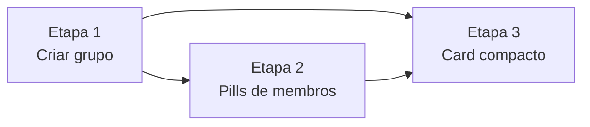

# Plano de desenvolvimento — backlog atual

Plano operacional para executar as três tarefas de [backlog.md](backlog.md), na ordem já definida lá.

**Referências:** @ref:backlog, @ref:refs (`docs/refs.yaml`), @ref:pt-br-design-system, @ref:pt-br-functional-components, @ref:pt-br-data-model, @ref:openapi.

**Stack:** client React/TypeScript (`client/`), API Java/Spring (`api/`), contrato @ref:openapi.

---

## Visão geral

| Etapa | Tarefa do backlog | Foco | Camadas |
|-------|-------------------|------|---------|
| 1 | Criar grupo na sessão Experiences | Jornada + endpoint novo | API + Client |
| 2 | Exibir membros do grupo na seleção de caixinhas | Contexto do grupo | Client |
| 3 | Compactar meta do card de experiência | Componente compartilhado | Client |

**Princípio:** entregar criação e grupo padrão antes de polir telas que dependem de “ter um grupo”; refinar o card de experiência por último para não competir com mudanças de layout em `BoxSelectionPage`.

---

## Etapa 1 — Criar grupo na sessão Experiences

**Tarefa:** Criar grupo na sessão Experiences  
**Objetivo:** Um toque cria turma solo; quem entra sem grupo ganha um por padrão; sem tela dedicada.

### 1.1 API — contrato e serviço

- [ ] Adicionar `POST /v1/groups` em `openapi/openapi.yaml` (resposta `GroupResponse`).
- [ ] Implementar em `GroupController` + serviço (reutilizar `createGroupWithMembers` com lista de um `participantId`).
- [ ] Garantir modo Experiences apenas (`AuthPrincipal`); rejeitar Experience Box se aplicável.
- [ ] **Provisionamento padrão:** ao listar grupos vazios, criar grupo solo automaticamente (em `GroupQueryService.listForPrincipal` ou método dedicado idempotente) — documentar decisão no PR.
- [ ] Testes: `POST` cria grupo com 1 membro; `GET` após login sem grupos retorna exatamente 1; segundo `GET` não duplica.

**Arquivos prováveis:** `api/.../group/`, `openapi/openapi.yaml`, `GroupIntegrationTest` ou novo teste.

### 1.2 Client — use case e listagem

- [ ] `CreateGroupUseCase` + tipo de resposta alinhado a `Group`.
- [ ] `GroupSelectionPage`: botão **Criar grupo**; handler chama API e prepend/atualiza lista.
- [ ] Diálogo de confirmação opcional (`groups.createDialog`) antes de criar — copy explica grupo solo + convite dentro do grupo.
- [ ] Remover dependência do empty state como única entrada: empty pode sumir para novos usuários (grupo padrão); manter hint de convite como texto secundário se ainda `length === 0` por falha de rede.
- [ ] i18n pt-BR, en, it.

### 1.3 Documentação

- [ ] `data-model.md` / `functional-components.md` (pt-BR + en): criação de grupo no Experiences + grupo padrão solo.

**Gate da etapa 1:**
- [ ] Novo registro Experiences → lista com ≥1 grupo sem ação manual.
- [ ] Criar grupo adiciona card; abrir → `BoxSelectionPage` inalterada em fluxo.
- [ ] Build API + client; testes de integração passando.

---

## Etapa 2 — Pills de membros na seleção de caixinhas

**Tarefa:** Exibir membros do grupo na seleção de caixinhas  
**Objetivo:** Faixa horizontal de pills com nomes de todos os membros.

**Depende de:** Etapa 1 (grupos solo e multi-membro estáveis na jornada).

### 2.1 Componente

- [ ] Criar `GroupMemberPills.tsx` + `.module.css` — pills com `displayName`, scroll horizontal.
- [ ] `aria-label` / rótulo acessível para a faixa.

### 2.2 Integrar em BoxSelectionPage

- [ ] Resolver `members` do `groupId` ativo (dados já vindos de `ListGroupsUseCase`).
- [ ] Posicionar entre `ScreenHeader` e toolbar (ou logo abaixo do título).
- [ ] Validar com 1, 2 e 5+ membros em 320px / 390px.

### 2.3 i18n

- [ ] Chaves `groups.membersStrip` ou equivalente nos três locales.

**Gate da etapa 2:**
- [ ] Todos os nomes acessíveis via scroll; toolbar intacta.
- [ ] Build client OK.

---

## Etapa 3 — Card de experiência compacto

**Tarefa:** Compactar meta do card de experiência  
**Objetivo:** Parâmetros sem fundo; coluna compacta; selo mínimo.

**Depende de:** Etapas 1–2 opcionais para validação manual na lista de experiências; tecnicamente independente, executada por último para evitar retrabalho visual.

### 3.1 Novo layout de parâmetro

- [ ] Adicionar `layout="listCompact"` (ou `ExperienceSummaryMeta variant="experienceList"`) em `ParameterStarField` / `ParameterStarsGroup`.
- [ ] Remover `background` e padding excessivo dos blocos de parâmetro nessa variante.
- [ ] Estrelas `sm`/`xs`; ícone e label menores; gaps reduzidos.

### 3.2 Selo reduzido na lista

- [ ] Usar `IntegritySeal` com variante adequada (`minimal` estendida ou `list`) — fonte ~0.6rem, opacidade baixa.
- [ ] Manter `title` com código completo do selo.

### 3.3 Integração e regressão

- [ ] `ExperienceSummaryMeta` → variante só para `ExperienceCard` (não `compact` da capa legada).
- [ ] Verificar `DrawCardCover` / `drawCover` / `list` em outros consumidores sem degradação.
- [ ] `ExperienceListPage` em 320px — parâmetros sem colisão.

**Gate da etapa 3:**
- [ ] Card visivelmente mais compacto; sem fundo nos parâmetros.
- [ ] Selo discreto mas acessível.
- [ ] Build + testes client passando.

---

## Validação final (todas as etapas)

| Fluxo | O que verificar |
|-------|-----------------|
| Registro / login Experiences | Lista já com 1 grupo (padrão) |
| Criar grupo | Novo card na lista; diálogo OK; abrir → caixinhas |
| Dentro do grupo | Pills com todos os membros; convidar/sair/criar caixinha OK |
| Lista de experiências | Card compacto; olho/editar/excluir OK |
| Sorteio (Experience Box) | Capa do sorteio (`DrawCardCover`) sem regressão |

---

## Sugestão de PRs

1. **PR 1** — Etapa 1a (API: `POST /v1/groups` + provisionamento padrão + OpenAPI + testes)
2. **PR 2** — Etapa 1b (Client: `GroupSelectionPage` + i18n + docs)
3. **PR 3** — Etapa 2 (`GroupMemberPills` + `BoxSelectionPage`)
4. **PR 4** — Etapa 3 (layout `listCompact` + selo na lista)

Os PRs 1b e 2 podem ser um único PR se preferir entrega atômica da jornada de grupo.

---

## Estimativa relativa de esforço

| Etapa | Complexidade | Motivo |
|-------|--------------|--------|
| 1 | Alta | Endpoint novo + regra de provisionamento + UX criar grupo + docs |
| 2 | Baixa–média | Componente novo + uma tela |
| 3 | Baixa–média | CSS/layout; risco de regressão em variantes de parâmetro |

**Total:** 3 entregas sequenciais; a Etapa 1 concentra o trabalho de backend e produto.
