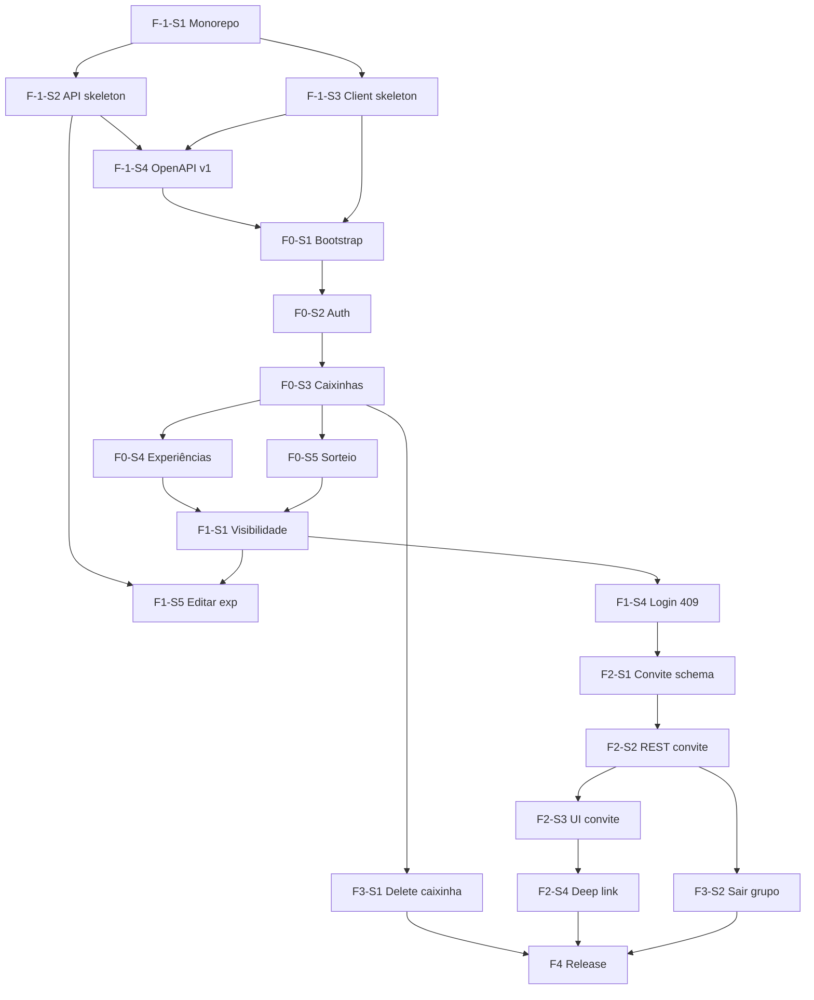

# Plano de Desenvolvimento para IA — Intensity

Este documento é o **artefato operacional** que transforma @ref:docs-en em execução incremental de software. Use **@ref:docs-en** e **@ref:plano-desenvolvimento-ia** (este arquivo na raiz) como ponto de partida para o agente — não é necessário nenhum outro material de referência.

Combina técnicas de mercado para especificação e planejamento:

| Técnica | Uso neste plano |
|---------|-----------------|
| **Doc-Driven Development** | @ref:docs-en é a única fonte de produto e engenharia |
| **Walking Skeleton + Tracer Bullet** | Fase F-1 cria monorepo; F0 entrega fluxo mínimo ponta a ponta |
| **Vertical Slices (Shape Up)** | Entregas por jornada completa (schema + API + client + testes) |
| **INVEST + BDD (Given/When/Then)** | Critérios de aceite verificáveis por slice |
| **Contract-First** | OpenAPI derivado de @ref:en-integrations-and-communication **antes** da implementação |
| **Traceability Matrix** | Doc → Épico → Slice → Endpoint/Tela → Teste |
| **Definition of Ready / Done** | Gates explícitos por slice |
| **Scope Catalog** | Inventário completo do que será construído |

**Público:** agentes de IA, mantenedor solo, revisores de PR.

**Stack obrigatória (Camada 4 — @ref:docs-en `engineering-and-operations/`):**

| Camada | Stack |
|--------|-------|
| **API** | Java 21, Spring Boot 3.5, Maven, Hibernate, Flyway, PostgreSQL 16, springdoc-openapi, JUnit 5 |
| **Client** | Node 22, TypeScript 5.7, React 19, Vite 6, Capacitor 7, Vitest 3 |
| **Infra** | Docker Compose, GitHub Actions → GHCR → webhook VPS, Caddy |

Referências: @ref:en-tools, @ref:en-technical-decisions (DT-01 … DT-15), @ref:en-development-process. Mapa: @ref:refs.

---

## 0. Premissas

| Premissa | Implicação |
|----------|------------|
| Repositório **novo** | Código criado do zero conforme este plano |
| Monorepo | Estrutura alvo definida neste plano (§2) |
| Spec em @ref:docs-en | Comportamento, arquitetura e engenharia — inclui convite e exclusão de caixinhas |
| @ref:plano-desenvolvimento-ia + @ref:docs-en | Únicas entradas obrigatórias para iniciar o agente |
| Idioma canônico da spec | @ref:docs-en; traduções @ref:docs-pt-br e @ref:docs-it para alinhamento de produto |

---

## 1. Hierarquia de verdade (obrigatória para IA)

Ordem de precedência ao implementar:

1. **Comportamento** → @ref:docs-en Camadas 1–2 (`product-conception/`, `solution-specification/`)
2. **Contrato e integração** → @ref:en-integrations-and-communication (Detailed)
3. **Estrutura e decisões** → `docs/en/solution-architecture/` + `docs/en/engineering-and-operations/` (ver @ref:refs)
4. **Contrato versionado no código** → @ref:openapi (criar na F-1 — §2)

### Terminologia canônica (API, UI, testes, commits)

Use os termos de domínio em inglês no código e contratos:

`Experience`, `Box`, `Experience Box`, `Group`, `Intensity`, `Draw`, `Reveal`, `Seal`, `Invite`, `Proponent`.

**Modos de acesso:**

| Modo (UI) | Sessão API | Endpoint login |
|-------------|------------|----------------|
| **Experiences** | Individual | `POST /v1/auth/login` |
| **Experience Box** | Grupo (multi-credencial) | `POST /v1/auth/grupo` |

---

## 2. Estrutura alvo do monorepo (criar na F-1)

```
intensity/
├── docs/                           # documentação do produto
├── plano-desenvolvimento-ia.md     # este plano (raiz)
├── openapi/
│   └── openapi.yaml                # contrato REST v1 — fonte contract-first
├── api/
│   ├── pom.xml
│   ├── Dockerfile
│   ├── docker-compose.yml          # Postgres local
│   └── src/main/
│       ├── java/.../intensity/
│       │   ├── participante/       # DT-12
│       │   ├── grupo/
│       │   ├── convite/
│       │   ├── caixinha/
│       │   └── experiencia/
│       └── resources/
│           ├── application.yml
│           └── db/migration/       # Flyway V1…Vn
├── client/
│   ├── package.json
│   ├── vite.config.ts
│   ├── capacitor.config.ts
│   └── src/
│       ├── app/                    # rotas, providers
│       ├── domain/                 # use cases (DT-13)
│       ├── adapters/               # API HTTP, Capacitor prefs
│       ├── presentation/           # telas React
│       ├── i18n/locales/           # en.json, pt-BR.json, it.json
│       └── content/                # suggestion packs (165), onboarding copy
├── .github/workflows/
│   └── api-ci.yml                  # test + docker push (DT-08)
└── README.md                       # como rodar local (development-process.md)
```

**Decisões de pasta:** `artifacts.md` (API modules, Client cognitive modules) · `technical-decisions.md` DT-12, DT-13.

---

## 3. Catálogo de escopo completo (tudo a construir)

Cada item abaixo é entregue por um ou mais slices, na ordem do critical path (§12).

### 3.1 Camada de persistência (Flyway)

| Entidade | Referência | Slice |
|----------|------------|-------|
| Participante + allowlist | `data-model.md` Participant | F0-S2 |
| Grupo + membership N:N | `data-model.md` Group | F0-S2 |
| Caixinha (11 tipos) | `data-model.md` Box Detailed | F0-S3 |
| Experiência + selo | `data-model.md` Experience | F0-S4 |
| Convite | `data-model.md` Invite | F2-S1 |
| Cascade delete caixinha → experiências | DT-15, AD-08 | F3-S1 |

### 3.2 API REST

| Área | Endpoints | Referência |
|------|-----------|------------|
| Auth/registro | `/v1/auth/login`, `/v1/auth/grupo`, `/v1/participantes` | `integrations-and-communication.md` Detailed |
| Grupos | `/v1/grupos`, `/v1/grupos/{id}/membros` | idem |
| Convites | `/v1/grupos/{id}/convites`, `/v1/convites/*` | idem + AD-07 |
| Caixinhas | GET/POST/DELETE `/v1/caixinhas`, list by group | idem + AD-08 |
| Experiências | CRUD `/v1/caixinhas/{id}/experiencias`, PUT/DELETE author | idem |

**Erros padronizados:** 401, 403, 404, 409, 410, 422 — tabela em `integrations-and-communication.md` Medium.

### 3.3 Client (14 telas + overlays)

Catálogo oficial: `functional-components.md` Screen catalog (#1–#14).

| # | Tela | Slice principal |
|---|------|-----------------|
| 1 | Bootstrap loading | F0-S1 |
| 2 | Onboarding (4 passos) | F0-S1 |
| 3 | Guia rápido | F0-S1 |
| 4 | Autenticação (4 sub-painéis) | F0-S2 |
| 5 | Entrar via convite | F2-S3 |
| 6 | Sessão desconhecida | F0-S2 |
| 7–8 | Seleção grupo / caixinha | F0-S3 |
| 9–10 | Lista + assistente 5 etapas | F0-S4 |
| 11–12 | Box home + criar caixinha | F0-S3 |
| 13 | Momento compartilhado | F0-S5 |
| 14 | Invite share sheet | F2-S3 |

### 3.4 Lógica exclusiva do client (sem API)

| Capacidade | Referência |
|------------|------------|
| Sorteio + filtros Any/Exact/Up to | `functional-components.md` Shared moment · AD-04 |
| Revelação (flip) + voltar ao sorteio | idem |
| Pacotes 165 sugestões embutidos | `data-model.md` Suggestion packs |
| Idioma UI + flag onboarding (Preferences) | `artifacts.md` Client owns |
| Deep link convite | F2-S4 · `platforms-and-environments.md` |

---

## 4. Protocolo de execução para agente de IA

Execute **um slice por sessão** (ou PR). Nunca misture fases.

### 4.1 Definition of Ready (DoR)

- [ ] Documentos do slice lidos (seções indicadas em §7)
- [ ] Dependências **Done** no grafo §12
- [ ] Se altera contrato: `openapi/openapi.yaml` atualizado **primeiro**
- [ ] Se altera schema: migration Flyway numerada sequencialmente

### 4.2 Loop de implementação

```
1. READ     → docs/en/ (docs do slice)
2. CONTRACT → openapi/openapi.yaml
3. DATA     → db/migration/V{n}__*.sql
4. API      → módulo domínio (Service > regras data-model Detailed)
5. CLIENT   → use case (domain/) + tela (presentation/) + i18n
6. TEST     → JUnit (API) + Vitest (lógica pura client)
7. MANUAL   → BDD §7 no browser (Vite) + smoke Capacitor se slice UI
8. DONE     → checklist §4.3
```

### 4.3 Definition of Done (DoD)

- [ ] BDD do slice passa manualmente
- [ ] Testes: caminho feliz + ≥1 erro de negócio
- [ ] OpenAPI reflete endpoints implementados
- [ ] Copy PT/EN/IT em `client/src/i18n/locales/`
- [ ] Estados loading / empty / error (`functional-components.md` Cross-cutting)
- [ ] Regras alinhadas a `data-model.md` (sem sorteio persistido, cascade delete, etc.)
- [ ] PR: rastreabilidade `Doc → Slice → arquivos`

### 4.4 Anti-padrões

- Implementar só API ou só UI num slice vertical
- Endpoints fora de `integrations-and-communication.md` sem ADR em `architectural-decisions.md`
- Persistir resultado de sorteio
- Soft-delete de caixinha (spec manda hard cascade — AD-08)
- Stack alternativa (RN, KMP, Node API, etc.) sem ADR em `architectural-decisions.md`
- Criptografar experiências (spec diz **not encrypted** — transparência)

---

## 5. Fases e appetites (Shape Up)

| Fase | Appetite | Objetivo |
|------|----------|----------|
| **F-1** | 2–3 dias | **Fundação** — monorepo, stack, CI mínima, OpenAPI v1 esboço |
| **F0** | 4–6 dias | **Walking skeleton** — auth → caixinha → experiência → sorteio local |
| **F1** | 3–5 dias | **Domínio completo** — visibilidade, selo, filtros, 409, editar exp |
| **F2** | 3–4 dias | **Convite** — REST + UI + deep link |
| **F3** | 2–3 dias | **Soberania** — delete caixinha + sair do grupo |
| **F4** | 2–4 dias | **Release** — a11y, i18n polish, deploy VPS, checklist stores |
| **F5** | contínuo | Evolução deferida (offline, push) |

**Circuit breaker:** slice > 2× appetite → parar, registrar decisão, não expandir escopo.

---

## 6. Matriz de rastreabilidade

| Slice | Doc principal | Entrega |
|-------|---------------|---------|
| **F-1-S1** | `tools.md`, `development-process.md` | Monorepo + README + `.gitignore` |
| **F-1-S2** | DT-01–03, `platforms-and-environments.md` | API Spring Boot + Compose Postgres + health |
| **F-1-S3** | DT-04–05 | Client Vite/React/TS + Capacitor shell |
| **F-1-S4** | `integrations-and-communication.md` Detailed | `openapi/openapi.yaml` v1 completo |
| **F-1-S5** | DT-08, `development-process.md` | GitHub Actions API CI + Dockerfile |
| F0-S1 | `functional-components` Flow A, `experience-and-identity` | Bootstrap, onboarding, guia, i18n base |
| F0-S2 | `data-model` Participant/Group, `integrations-and-communication` Auth | Flyway V1 auth + registro + login dual |
| F0-S3 | `functional-components` Flows B/C, `data-model` Box | Grupo, caixinha, telas 7–8, 11–12 |
| F0-S4 | `functional-components` assistant, `data-model` Experience | Assistente 5 etapas + CRUD |
| F0-S5 | `functional-components` Shared moment, AD-01/04 | Sorteio local tela 13 |
| F1-S1 | `data-model` Visibility | Respostas API filtradas + cards cover/face |
| F1-S2 | `design-system.md`, `experience-and-identity` | Intensity chips, filter labels Exact/Up to |
| F1-S3 | `data-model` Seal | Selo server-side + UI |
| F1-S4 | `functional-components` Auth Detailed | Login Caixa → 409 grupos distintos |
| F1-S5 | `functional-components` Edit experience | PUT autor-only |
| F2-S1 | `data-model` Invite, DT-14 | Flyway convite + módulo `convite/` |
| F2-S2 | `integrations-and-communication` | REST convite + testes integração |
| F2-S3 | `functional-components` Flow D, `experience-and-identity` | Telas 5, 14 + share sheet |
| F2-S4 | `platforms-and-environments`, `tools.md` | App Links / Universal Links |
| F3-S1 | AD-08, DT-15, `functional-components` Box deletion | DELETE cascade |
| F3-S2 | `data-model` Leave group | DELETE membro + último membro |
| F4-S1 | `experience-and-identity` Detailed | UX destrutiva + a11y |
| F4-S2 | `development-process`, `team-and-responsibilities` | Deploy VPS + build store |

---

## 7. Slices detalhados

### Fase F-1 — Fundação

#### F-1-S1: Monorepo e documentação operacional

**Docs:** `tools.md` Medium (Repository layout) · `development-process.md` · `technical-decisions.md` DT-06

**Entregáveis:**

- Estrutura §2 criada (pastas vazias com `.gitkeep` onde necessário)
- `README.md`: JDK 21, Node 22, Docker, comandos `./mvnw`, `npm run dev`
- Referência explícita: spec @ref:docs-en, plano @ref:plano-desenvolvimento-ia

**BDD:**

```gherkin
Given clone fresh do repo
When sigo README
Then consigo instalar dependências api e client sem erros
```

---

#### F-1-S2: API skeleton + Postgres

**Docs:** `artifacts.md` API artifact · `platforms-and-environments.md` Local · DT-01–03

**Entregáveis:**

- Spring Boot 3.5, Java 21, Maven wrapper
- `docker-compose.yml`: PostgreSQL 16
- `application.yml` + perfil local
- `GET /actuator/health` → 200
- Pacotes vazios: `participante`, `grupo`, `convite`, `caixinha`, `experiencia`
- springdoc `/v3/api-docs` habilitado em dev

**BDD:**

```gherkin
Given docker compose up e spring-boot:run
When GET /actuator/health
Then 200 OK
And Flyway baseline aplicado (schema vazio ou V1 placeholder)
```

---

#### F-1-S3: Client skeleton (React + Capacitor)

**Docs:** `artifacts.md` Client · DT-04–05 · `development-process.md` Local client workflow

**Entregáveis:**

- Vite 6 + React 19 + TypeScript strict
- Capacitor 7 init (android + ios folders)
- Plugins: App, Status Bar, Splash Screen, Preferences (`tools.md`)
- `.env.development`: `VITE_API_URL=http://localhost:8080`
- Roteador mínimo + tela placeholder
- Estrutura `domain/`, `adapters/`, `presentation/` (`technical-decisions.md` DT-13)

**BDD:**

```gherkin
Given npm run dev
When abro localhost:5173
Then app renderiza shell Intensity

Given npm run build && npx cap sync
When abro Android emulator
Then WebView carrega dist/
```

---

#### F-1-S4: OpenAPI v1 (contract-first)

**Docs:** `integrations-and-communication.md` Detailed (REST resource outline + flows + errors)

**Entregáveis:**

- `openapi/openapi.yaml` com **todos** os recursos v1 documentados (implementação pode ser incremental)
- Schemas: Participant, Group, Box, Experience, Invite, Error
- Security: bearer JWT
- Paths conforme spec (prefixo `/v1/`):

```
POST /v1/auth/login
POST /v1/auth/grupo
POST /v1/participantes
GET  /v1/grupos
GET|DELETE /v1/grupos/{id}/membros
POST|GET /v1/grupos/{id}/convites
GET  /v1/convites/validar
POST /v1/convites/{id}/aceitar
DELETE /v1/convites/{id}
GET  /v1/grupos/{id}/caixinhas
POST /v1/caixinhas
DELETE /v1/caixinhas/{id}
GET|POST /v1/caixinhas/{id}/experiencias
PUT|DELETE /v1/experiencias/{id}
```

**DoD:** validação spectral ou lint OpenAPI sem erros; gerar tipos TS opcional (`openapi-typescript`).

---

#### F-1-S5: CI API + Docker image

**Docs:** `development-process.md` API deploy pipeline · DT-07–08

**Entregáveis:**

- `api/Dockerfile` multi-stage
- `.github/workflows/api-ci.yml`: `./mvnw test` + build push GHCR (secrets documentados no README)
- Webhook deploy documentado (execução VPS manual ok na F4)

---

### Fase F0 — Walking skeleton

#### F0-S1: Bootstrap, onboarding, guia rápido

**Docs:** `functional-components.md` Bootstrap/Onboarding/Quick guide Detailed · `experience-and-identity.md` Onboarding visual Medium

**Client:**

- Preferences: `language`, `onboardingCompleted`
- Telas 1–3; navegação pós-onboarding → Auth
- i18n: arquivos base `en`, `pt-BR`, `it`

**BDD:**

```gherkin
Given primeira instalação
When app inicia
Then bootstrap → onboarding 4 passos → autenticação
When onboarding concluído
Then flag local impede reexibição
```

---

#### F0-S2: Participante, auth, grupo (login dual)

**Docs:** `data-model.md` Participant, Group formation · `functional-components.md` Authentication Detailed · `integrations-and-communication.md` Auth flows

**Flyway V1:** `participante`, `grupo`, `grupo_participante`, allowlist email

**API:**

- Registro com allowlist → 403 se email não permitido
- `POST /v1/auth/login` → JWT Experiences
- `POST /v1/auth/grupo` → resolve/cria grupo por combinação de participantes

**Client:** Auth tela 4 — sub-painéis Experiences, Experience Box (+), Registration; tela 6 unknown session

**BDD:**

```gherkin
Given email na allowlist
When registro
Then 201 + token

Given credenciais válidas
When login Experiences
Then sessão individual

Given A e B válidos
When login Experience Box com A + B
Then grupo criado ou reaberto
And navegação → box home
```

---

#### F0-S3: Caixinhas e navegação de sessão

**Docs:** `functional-components.md` Flows B/C · `data-model.md` Box (11 tipos)

**Flyway V2:** `caixinha` (tipo enum/string, FK grupo)

**API:** list/create caixinhas; POST exige sessão Experience Box ou membro grupo

**Client:** telas 7–8 (Experiences path), 11–12 (box home + create); grid 2 colunas; tipo default Saídas com amigos

**BDD:**

```gherkin
Given sessão Experiences com grupo selecionado
When escolho caixinha
Then lista experiências (pode estar vazia)

Given sessão Experience Box
When crio caixinha nome + tipo
Then aparece na grid box home
```

---

#### F0-S4: Experiências — assistente 5 etapas + listagem

**Docs:** `functional-components.md` Creation assistant · `data-model.md` Experience, Suggestion packs · `how-it-works.md` Collection phase

**Flyway V3:** `experiencia` + selo

**API:** POST/GET caixinha; DELETE/PUT autor; validação 422 (intensidade 1–5, tamanhos)

**Client:**

- Assistente overlay 5 etapas + progresso
- `content/suggestion-packs/` — 165 exemplos (11×5×3) PT/EN/IT (`data-model.md`)
- Lista tela 9; aviso não criptografado

**BDD:**

```gherkin
When completo assistente
Then experiência persistida com selo derivado da descrição
When toco sugestão
Then inspira etapa 1 sem salvar automaticamente
```

---

#### F0-S5: Momento compartilhado (sorteio + revelação)

**Docs:** `functional-components.md` Shared moment Detailed · `data-model.md` Draw result · `principles-why-it-works-this-way.md` · AD-01, AD-04

**Client only:**

- `domain/sorteio/ExecutarSorteioUseCase.ts`
- `domain/sorteio/FiltroIntensidadePolicy.ts`
- `domain/sorteio/RevelacaoOrchestrator.ts`
- Tela 13: filtros Any/Exact/Up to; flip Y; hint amber; voltar ao sorteio
- GET pool imediatamente antes do sorteio

**BDD:**

```gherkin
Given caixinha com experiências
When sorteio com filtro Exact nível 3
Then capa sem descrição; após Revelar mostra texto + reflexão
And zero POST de sorteio na API
When volto ao sorteio
Then nova seleção aleatória
```

---

### Fase F1 — Domínio completo

#### F1-S1: Visibilidade

**Docs:** `data-model.md` Visibility rules · `functional-components.md` Experience list Detailed

**API:** DTOs listagem — autor vê full; outros veem summary (intensidade + selo)

**Client:** cards lista; capa sorteio vs face revelada

---

#### F1-S2: Intensidade UX + validação

**Docs:** `design-system.md` Intensity scale · `experience-and-identity.md` · `data-model.md` Draw filters

Labels **Exact** / **Up to**; affective warmth scale (1–5) per `design-system.md`

---

#### F1-S3: Selo de integridade

**Docs:** `data-model.md` Seal · `experience-and-identity.md` Terminology

Serviço API recalcula selo se descrição mudar; exibir em cards (`Selo`, nunca "hash" na UI)

---

#### F1-S4: Login Experience Box — conflito 409

**Docs:** `functional-components.md` Authentication Detailed · `integrations-and-communication.md` 409

```gherkin
Given Alice só Grupo G1 e Bob só Grupo G2
When POST /v1/auth/grupo com Alice + Bob
Then 409 + mensagem user-facing
```

---

#### F1-S5: Editar experiência (autor)

**Docs:** `functional-components.md` Experience list Detailed

PUT `/v1/experiencias/{id}` — 403 non-author

---

### Fase F2 — Convite

#### F2-S1: Schema + domínio

**Docs:** `data-model.md` Invite Detailed · DT-14 · AD-07

Flyway V4: `convite`; módulo `convite/`; políticas expiração 7d, código Crockford 6 chars

---

#### F2-S2: REST convite

**Docs:** `integrations-and-communication.md` Invite lifecycle · Error contract

Testes integração: expirado → 410; revoke; accept; already member → 409

---

#### F2-S3: UI convite

**Docs:** `functional-components.md` Flow D, telas 5 e 14 · `experience-and-identity.md` Invite sharing (yellow/teal accent per `design-system.md`)

Share sheet nativo Capacitor; preview display names sem email

---

#### F2-S4: Deep link

**Docs:** `integrations-and-communication.md` Invite link · `tools.md` Invite-specific tooling

`https://app.intensity.example/join?t={token}` — Android App Links + iOS Associated Domains

---

### Fase F3 — Soberania do grupo

#### F3-S1: DELETE caixinha

**Docs:** `data-model.md` Box deletion · `functional-components.md` Box deletion · AD-08 · DT-15

Dialog confirmação N experiências; `ON DELETE CASCADE`; 204

---

#### F3-S2: Sair do grupo

**Docs:** `data-model.md` Leave / Last member · `functional-components.md` Permissions

Último membro → remove grupo, caixinhas, experiências, convites

---

### Fase F4 — Release

#### F4-S1: A11y + UX destrutiva

**Docs:** `experience-and-identity.md` Destructive actions, Accessibility · `functional-components.md` Cross-cutting

---

#### F4-S2: Deploy produção + stores

**Docs:** `development-process.md` Detailed · `platforms-and-environments.md` Production · DT-08, DT-09

Ordem: API deploy → client store build com `VITE_API_URL` produção

---

## 8. Estratégia de testes

Ref: `development-process.md` Testing strategy.

| Camada | Ferramenta | Escopo |
|--------|------------|--------|
| API unit/integration | JUnit 5, Spring Boot Test, Testcontainers Postgres | Services, controllers, migrations |
| Client unit | Vitest 3 | Filtro intensidade, selo client-side, validação código convite |
| Contract | OpenAPI vs controllers (springdoc ou testes MockMvc) | F-1-S4 onward |
| Manual BDD | Browser + emulador | DoD obrigatório todo slice |

### Roteiro manual pré-release (happy path)

1. F-1: health + dev server ok
2. Registrar A, B (allowlist)
3. Login Experience Box A+B → criar caixinha
4. A gera convite; C aceita por código
5. C contribui experiência (Experiences)
6. Experience Box A+B → sorteio → revelar
7. Excluir caixinha secundária → confirmar cascade
8. Flow E — sessão desconhecida → logout

Ref: `functional-components.md` Flows A–E.

---

## 9. Registro de riscos

| Risco | Prob. | Impacto | Mitigação | Doc |
|-------|-------|---------|-----------|-----|
| Scope creep | Alta | Alto | Slices verticais; circuit breaker §5 | Shape Up |
| OpenAPI ≠ implementação | Média | Alto | Contract-first F-1-S4; DoD sync | `integrations-and-communication.md` |
| Convite spam | Média | Médio | Expiração 7d, revoke | AD-07 |
| Delete acidental | Média | Alto | Dialog N experiências | AD-08 |
| Store rejeita deep link | Média | Médio | F2-S4 cedo | `tools.md` |
| API/client dessincronizados | Baixa | Alto | DT-10; deploy API antes client | `development-process.md` |

---

## 10. Backlog deferido (sem ADR não implementar)

- Modo offline (AD-06)
- Histórico de sorteios
- Push / polling novas experiências
- Rastrear consequências sociais voluntárias
- Ambiente staging dedicado
- OTA Capacitor bundles (DT-11)
- E2E mobile CI

Ref: `architectural-decisions.md` Future evolution · `development-process.md` Deferred.

---

## 11. Template de prompt para agente (por slice)

```markdown
## Tarefa: [SLICE_ID] — [Título]

### Contexto
Implementação conforme `docs/` e este plano.
Stack: Spring Boot 3.5 + React 19 + Capacitor 7 (ver docs/en/engineering-and-operations/tools.md).

### Documentação obrigatória
- [listar paths docs/en/ + seções]

### Contrato
- Atualizar openapi/openapi.yaml ANTES de implementar endpoints deste slice

### Critérios BDD
[colar Given/When/Then do §7]

### Estrutura alvo
- API: api/src/main/java/.../intensity/{modulo}/
- Client: client/src/{domain|adapters|presentation}/

### Restrições
- Flyway para schema
- i18n en + pt-BR + it
- Não persistir sorteio
- DoD §4.3

### Entregar
Código + testes + nota Doc→Slice→arquivos
```

---

## 12. Critical path



---

## 13. Critérios de aceite deste plano

- [x] Autossuficiente com `docs/` + este arquivo (raiz)
- [x] Stack alinhada a `docs/` Camada 4
- [x] Fase F-1 cria fundação antes de features
- [x] OpenAPI contract-first centralizado em `openapi/openapi.yaml`
- [x] 14 telas mapeadas a slices
- [x] Convite + delete + sorteio não persistido cobertos em BDD
- [x] Critical path ordenado F-1 → F0 → F1 → F2 → F3 → F4

---

*Spec canônica: @ref:docs-en (45 documentos em 3 idiomas). Plano operacional: @ref:plano-desenvolvimento-ia. Mapa: @ref:refs.*

---

## Como iniciar em um repositório novo

1. Crie o repositório vazio (ou com README mínimo).
2. Copie a pasta **`docs/`** (@ref:docs-en, @ref:docs-pt-br, @ref:docs-it) e **`plano-desenvolvimento-ia.md`** (@ref:plano-desenvolvimento-ia) na raiz do repositório.
3. Abra o agente com o prompt:

```markdown
Leia integralmente:
- @ref:plano-desenvolvimento-ia
- @ref:en-how-it-works (Medium)
- @ref:en-data-model (Medium)
- @ref:en-functional-components (Medium)
- @ref:en-integrations-and-communication (Detailed)

Execute o slice **F-1-S1**, depois F-1-S2 … na ordem do §12.
Respeite DoR/DoD deste plano. Spec canônica: @ref:docs-en.
```

4. Avance **um slice por sessão/PR** até F4.
