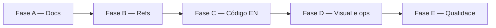

# Plano de Desenvolvimento Unificado — Intensity

Este documento consolida o @ref:backlog, o @ref:plano-desenvolvimento-ia (MVP já entregue), o `backlog-draft.md` e as especificações concorrentes numa **única sequência executável por slices**, otimizada para agentes de IA.

**Mapa de referências:** @ref:refs — cite artefatos como `@ref:<id>` nos prompts e documentação.

**Público:** agentes de IA e mantenedor humano.  
**Escopo:** tarefas pós-MVP do backlog formal + itens do rascunho que dependem das fundações.  
**Não substitui:** a spec de produto em @ref:docs-en nem o plano operacional de features (@ref:plano-desenvolvimento-ia).

---

## 1. Estado atual do repositório

| Área | Situação |
|------|----------|
| **MVP funcional** | Monorepo com `api/`, `client/`, `openapi/`, `deploy/` — fases F-1 → F4 do plano original executadas |
| **Documentação** | Em `docs/`; plano operacional na raiz (`plano-desenvolvimento-ia.md`) |
| **Identidade visual na spec** | Alinhada via `design-system.md` + `experience-and-identity.md` (DOC-3) |
| **Identidade visual canônica** | `docs/en/solution-specification/design-system.md` |
| **Artefatos de redesign** | Removidos (DOC-2) |
| **Código** | Identificadores em português (`participante`, `grupo`, `caixinha`, `/v1/grupos`, etc.) |
| **Plano original** | Prescreve nomes em inglês no código — **conflita com o código atual** |
| **Referências cruzadas** | Mapa @ref:refs ativo; validação `python3 scripts/validate-refs.py` |
| **Agentes** | Duas pastas: `agents/` (2 prompts) e `agentes/` (workflow completo) — não consolidadas |
| **CI** | `.github/workflows/api-ci.yml` — sem validação de referências de docs |

---

## 2. Conflitos entre especificações e decisões unificadas

Antes de executar qualquer slice, agentes devem seguir esta tabela de precedência.

| Conflito | Fontes em disputa | **Decisão unificada** | Onde aplicar |
|----------|-------------------|----------------------|--------------|
| Pasta de documentação | ~~`newdocs/`~~ → `docs/` | **Concluído** (DOC-1) | — |
| Local do plano operacional | ~~`newdocs/plano-desenvolvimento-ia.md`~~ → raiz | **Concluído** (DOC-1) | — |
| Identidade visual | `experience-and-identity.md` vs Style Guide vs `UX-Redesign-Proposal.md` | **Style Guide** vira `design-system.md` na camada 2; `experience-and-identity.md` mantém tom, terminologia e UX comportamental; remove tokens visuais obsoletos; Proposal/Audit são **descartados** após extração | Slices DOC-2, DOC-3 |
| Intensidade (cores 1–5) | Spec antiga (verde→vermelho) vs Proposal (calor afetivo teal→coral) | Adotar escala do design system integrado (sem semáforo de risco); detalhes em `design-system.md` | DOC-2 + fase visual futura |
| Idioma do código | Código PT vs `technical-decisions.md` DT-12/13 vs `plano-desenvolvimento-ia.md` §1 | **Inglês** em pacotes, classes, endpoints, tabelas, OpenAPI; UI permanece em i18n | Fase C |
| Versão da API no rename | DT-10 (`/v2` se breaking) vs backlog (coordenado em `/v1`) | Renomear em `/v1` numa única entrega coordenada API + client + OpenAPI — app ainda não em uso externo massivo | Fase C, slice CODE-1 |
| Referências em markdown | Paths físicos vs mapa centralizado | Após Fase B, citar `@ref:<id>` nos arquivos migrados; paths só no mapa | Fase B |
| Tradução de docs | Backlog código vs prosa pt-br/it | Traduzir **apenas** referências a código (classes, endpoints, tabelas); prosa de produto permanece no idioma de cada doc | Fase C, slice CODE-6 |
| Implementação visual | Style Guide integrado na spec vs código com tema escuro/teal | Spec primeiro (Fase A); implementação em CSS/componentes **depois** das fundações doc + refs + rename (Fase D) | Ordem global |
| `agents/` vs `agentes/` | Duas árvores paralelas | Consolidar numa fase futura (D-4); até lá, `agents/write-task.md` e `agents/order-backlog.md` são os prompts do backlog na raiz | Fase D opcional |

### Hierarquia de verdade (pós Fase A)

1. **Comportamento de produto** → `docs/en/` camadas 1–2  
2. **Design visual** → `docs/en/solution-specification/design-system.md`  
3. **Identidade e UX comportamental** → `docs/en/solution-specification/experience-and-identity.md` (sem contradizer o design system)  
4. **Contrato REST** → `openapi/openapi.yaml` (alinhado a `integrations-and-communication.md`)  
5. **Decisões de engenharia** → `docs/en/engineering-and-operations/technical-decisions.md`  
6. **Mapa de referências** → `docs/refs.yaml` (pós Fase B)  
7. **Plano de features MVP** → `plano-desenvolvimento-ia.md` (raiz) — histórico; novas entregas seguem este plano unificado  

---

## 3. Visão geral das fases



| Fase | Objetivo | Slices | Depende de |
|------|----------|--------|------------|
| **A** | Documentação canônica e design system integrado | DOC-1 … DOC-3 | — |
| **B** | Mapa centralizado de referências + validação | REF-1 … REF-3 | A |
| **C** | Código e contrato em inglês | CODE-0 … CODE-7 | A, B |
| **D** | Visual, deploy, estrutura de agentes (rascunho) | VIS-1 … VIS-3, DEPLOY-1, AGENTS-1 | A, C (VIS após C) |
| **E** | Code review e hardening (rascunho) | REVIEW-1 | C |

**Regra de ouro:** um slice = uma sessão de agente / um PR focado. Build verde ao final de cada slice quando tocar código.

---

## 4. Fase A — Fundações documentais

Origem: backlog → *Refatorar e consolidar documentação do produto*.

### Slice DOC-1 — Renomear estrutura e reposicionar plano ✅

**Status:** concluído.

**Entregas:**
- Renomear `newdocs/` → `docs/`
- Mover `docs/plano-desenvolvimento-ia.md` → `plano-desenvolvimento-ia.md` (raiz)
- Atualizar referências em: `README.md`, `client/STORE_RELEASE.md`, `openapi/openapi.yaml`, `docs/**`, `agents/*.md`, conteúdo interno do plano na raiz
- Ajustar plano na raiz: `docs/en/` como spec; auto-referência na raiz

**Não fazer:** integrar design system, remover artefatos UX, alterar código.

**DoD:**
- [x] Pasta `newdocs/` não existe
- [x] `plano-desenvolvimento-ia.md` na raiz com links corretos
- [x] `grep -r newdocs` no repo retorna zero em código e docs (backlog e este plano citam o path antigo apenas como histórico)

**Prompt IA (resumo):** executar renomeação e varredura de paths; não alterar semântica de spec.

---

### Slice DOC-2 — Integrar design system (inglês canônico) ✅

**Status:** concluído.

**Entregas:**
- `docs/en/solution-specification/design-system.md` criado (Short / Medium / Detailed)
- Conteúdo do Style Guide + tokens declarativos da Proposal integrados
- Nota de integração em `experience-and-identity.md`; referência em `functional-components.md`
- Removidos: `Intensity-Design-System-Style-Guide.md`, `UX-Audit.md`, `UX-Redesign-Proposal.md`, `ux-refactor-agent.md`

**DoD:**
- [x] `design-system.md` existe em `docs/en/solution-specification/`
- [x] Artefatos soltos de refatoração removidos da raiz de `docs/`
- [x] `docs/` contém apenas `en/`, `pt-br/`, `it/` na raiz

---

### Slice DOC-3 — Alinhar identidade e sincronizar idiomas ✅

**Status:** concluído.

**Entregas:**
- `experience-and-identity.md` alinhado em en, pt-br, it (sem marrom/azul/semáforo; referência ao design system)
- `design-system.md` traduzido para pt-br e it
- `functional-components.md` com referência ao design system nos 3 idiomas
- Referências visuais obsoletas corrigidas em `plano-desenvolvimento-ia.md` (F1-S2, F2-S3)

**DoD:**
- [x] `experience-and-identity.md` não contradiz design system nos 3 idiomas
- [x] `design-system.md` existe em en, pt-br, it
- [x] Nenhum link quebrado para paths antigos ou artefatos removidos

---

## 5. Fase B — Mapa centralizado de referências

Origem: backlog → *Centralizar referências de documentação*.

### Slice REF-1 — Criar registro canônico ✅

**Status:** concluído — @ref:refs (`docs/refs.yaml`) com 58 entradas (15 docs × 3 idiomas + pastas + entry points).

**DoD:**
- [x] Arquivo versionado com documentação de uso no próprio arquivo
- [x] Todos os docs em `docs/en/` têm entrada no mapa

---

### Slice REF-2 — Migrar arquivos prioritários ✅

**Status:** concluído — README, planos, backlog, agents, STORE_RELEASE, openapi, tools.md migrados para `@ref:<id>`.

**DoD:**
- [x] Arquivos prioritários usam `@ref:` de forma consistente
- [x] Instruções em `agents/write-task.md` e `agents/order-backlog.md` mandam consultar o mapa

---

### Slice REF-3 — Validação e CI ✅

**Status:** concluído — `scripts/validate-refs.py` + `.github/workflows/docs-ci.yml`.

**DoD:**
- [x] Script roda localmente e no CI
- [x] CI falha em path inexistente ou id órfão nos arquivos migrados

---

## 6. Fase C — Código-fonte em inglês

Origem: backlog → *Traduzir código-fonte para inglês*.

**Pré-requisitos:** Fases A e B concluídas.

### Mapa de tradução de domínio (canônico)

| Português (atual) | Inglês (alvo) |
|-------------------|---------------|
| participante | participant |
| grupo | group |
| caixinha | box |
| experiencia | experience |
| convite | invite |
| sorteio | draw |
| revelacao | revelation |
| filtro (intensidade) | intensity filter |
| validar | validate |
| aceitar | accept |
| membros | members |

Expandir na Slice CODE-0 com inventário completo (métodos, colunas, DTOs, testes).

---

### Slice CODE-0 — Inventário e tabela de renomeação

**Objetivo:** zero surpresas antes de tocar código.

**Entregas:**
- Listar: pacotes Java, classes, `@RequestMapping`, `@Table`/`@Column`, repositórios, DTOs, testes
- Listar: pastas `client/src/domain/*`, adapters, chamadas HTTP
- Listar: migrações Flyway existentes (`V1`…`Vn`)
- Listar: referências a código em docs + entradas do `docs/refs.yaml`
- Validar tabela contra OpenAPI e suite de testes atual (baseline verde)

**DoD:**
- [ ] Documento `docs/engineering-and-operations/rename-map.md` ou seção no PR com tabela completa
- [ ] `./mvnw test` e `npm test` verdes no baseline

---

### Slice CODE-1 — OpenAPI como contrato

**Objetivo:** contract-first antes da API e do client.

**Entregas:**
- Atualizar `openapi/openapi.yaml`: paths, tags, operationIds, schemas
- Exemplos: `/v1/grupos` → `/v1/groups`, `/v1/participantes` → `/v1/participants`, `/v1/caixinhas` → `/v1/boxes`, `/v1/auth/grupo` → `/v1/auth/group`, etc.
- Atualizar `@ref:openapi` no mapa se necessário

**DoD:**
- [ ] OpenAPI reflete tabela de tradução
- [ ] Nenhum path REST em português no YAML

---

### Slice CODE-2 — API Java (pacotes e camada REST)

**Objetivo:** renomear módulos de domínio sem mudar comportamento.

**Ordem interna sugerida:**
1. Pacotes e `package-info.java`
2. Entidades JPA + repositórios
3. Services
4. Controllers e DTOs
5. Testes unitários e de integração

**DoD:**
- [ ] Pacotes `com.intensity.{participant,group,box,experience,invite}`
- [ ] Controllers mapeiam paths do OpenAPI atualizado
- [ ] `./mvnw test` verde

---

### Slice CODE-3 — Schema PostgreSQL (Flyway)

**Objetivo:** nomes de tabelas/colunas em inglês reproduzíveis do zero.

**Regra Flyway:**
- **Não editar** migrações já aplicadas em produção
- Criar **nova** migração `V{n+1}__rename_*` com `ALTER TABLE … RENAME` se houver ambiente com dados
- Se greenfield exclusivo: avaliar consolidar apenas se histórico não estiver em produção

**DoD:**
- [ ] Entidades JPA e schema alinhados
- [ ] `flyway migrate` em banco limpo funciona do zero
- [ ] `./mvnw test` (testcontainers ou H2) verde

---

### Slice CODE-4 — Client: domain e adapters

**Objetivo:** pastas, use cases e HTTP alinhados ao contrato.

**Entregas:**
- Renomear `domain/convite/` → `domain/invite/`, `domain/sorteio/` → `domain/draw/`, etc.
- Atualizar `ExecutarSorteioUseCase` → `ExecuteDrawUseCase`, `RevelacaoOrchestrator` → `RevelationOrchestrator`, `FiltroIntensidadePolicy` → `IntensityFilterPolicy`
- Adapters HTTP com novos paths
- Testes de domínio

**Não alterar:** `client/src/i18n/locales/*.json` (copy de usuário), exceto chaves que espelhem código interno (improvável)

**DoD:**
- [ ] `npm test` e `npm run build` verdes
- [ ] Nenhuma chamada HTTP a path em português

---

### Slice CODE-5 — Client: presentation e imports residuais

**Objetivo:** fechar renomeações na camada UI e configs.

**Entregas:**
- Corrigir imports após rename de domain
- Verificar `vite.config.ts`, Capacitor, deep links (paths de API em config, não rotas de app)
- `./mvnw test` + `npm test` + build completo

**DoD:**
- [ ] Repositório compila e testa sem referências PT em código

---

### Slice CODE-6 — Documentação e mapa de referências

**Objetivo:** docs citam código com nomes novos.

**Arquivos:**
- `docs/en/solution-architecture/integrations-and-communication.md`
- `docs/en/engineering-and-operations/technical-decisions.md` (exemplos DT-12/13)
- `plano-desenvolvimento-ia.md`, `README.md`, `client/STORE_RELEASE.md`
- Atualizar `path` no `docs/refs.yaml` para arquivos de código renomeados; **manter `id` estável**

**Não traduzir:** prosa de produto em pt-br/it além de refs técnicas a código.

**DoD:**
- [ ] Exemplos em `technical-decisions.md` mostram `ExecuteDrawUseCase`, `participant/`, `group/`
- [ ] Mapa de refs atualizado; `validate-refs` verde

---

### Slice CODE-7 — Gate final de consistência

**Objetivo:** provar entrega coordenada.

**Checklist:**
- [ ] `./mvnw test` (API)
- [ ] `npm test` + `npm run build` (client)
- [ ] OpenAPI vs controllers (springdoc ou diff manual)
- [ ] `scripts/validate-refs` (ou equivalente)
- [ ] Grep: sem `participante`, `grupo`, `caixinha`, `experiencia`, `convite`, `sorteio` em código (exceto i18n e comentários históricos se explicitamente permitidos)

---

## 7. Fase D — Visual, deploy e agentes (backlog-draft)

Itens do `backlog-draft.md` **fora** do `backlog.md` formal, ordenados após Fase C para evitar retrabalho em paths e tokens.

### Slice VIS-1 — Fundação de design tokens no client

**Origem:** Style Guide + Proposal §2 (tokens CSS).

**Entregas:**
- CSS variables em arquivo global (`client/src/presentation/theme/tokens.css` ou equivalente)
- Tokens: `--bg #FFF7ED`, `--coral`, `--yellow`, `--purple`, `--teal`, tipografia arredondada, sombras suaves
- Remover tema escuro default e `color-scheme: dark` onde existir
- Escopo de intensidade 1–5 conforme `design-system.md`

**DoD:** app em light mode quente; tokens documentados batem com spec.

---

### Slice VIS-2 — Componentes base

**Origem:** Proposal §3 — cards colecionáveis, botões, badges, RatingScale, IntegritySeal.

**Entregas:** refatorar componentes em `client/src/presentation/components/` para flat cartoon (bordas generosas, cores sólidas, sem aparência SaaS).

**DoD:** componentes base alinhados ao `design-system.md`; sem regressão funcional nos testes existentes.

---

### Slice VIS-3 — Telas e assets (logos)

**Origem:** backlog-draft → *Logos e ajustes visuais* + Proposal §6.

**Entregas:**
- Wordmark/logo conforme design system (sem gradiente corporativo antigo)
- Passar telas críticas: bootstrap, auth, box home, draw ritual, invite
- Manifest de ilustrações/onboarding se aplicável

**DoD:** checklist do Proposal §10 (critérios de aprovação por tela) para telas do critical path.

---

### Slice DEPLOY-1 — Limpar e documentar VPS

**Origem:** backlog-draft → *Deploy - Limpar VPS*.

**Entregas:**
- Revisar `deploy/`: scripts, `.env.example`, imagens órfãs, domínios
- Documentar procedimento de reset/limpeza em `deploy/README.md`
- Verificar webhook, GHCR, health checks pós-rename de API (se paths mudaram em configs)

**DoD:** deploy reproduzível documentado; stack sobe com imagem renomeada se aplicável.

---

### Slice AGENTS-1 — Consolidar estrutura de agentes

**Origem:** backlog-draft → *Nova estrutura Source / Deploy / Docs / Agents*.

**Situação:** `agents/` (backlog prompts) vs `agentes/` (tasks, workflows, conventions).

**Entregas propostas:**
- Definir pasta canônica: `agents/` na raiz com subpastas `prompts/`, `workflows/`, `tasks/`
- Migrar conteúdo útil de `agentes/`; remover duplicata
- Atualizar `@ref:` no mapa
- Agente de processo de desenvolvimento apontando para este plano unificado

**DoD:** uma única árvore de agentes; README de agentes na raiz da pasta.

---

## 8. Fase E — Qualidade (backlog-draft)

### Slice REVIEW-1 — Code review sistemático pós-refactor

**Origem:** backlog-draft → *Code review*.

**Entregas:**
- Revisão de segurança (JWT, convites, delete cascade DT-15)
- Revisão de consistência OpenAPI ↔ API ↔ client
- Revisão de acessibilidade mínima nas telas refatoradas (VIS)
- Lista de débitos técnicos → issues ou `backlog.md`

**DoD:** relatório curto em `docs/engineering-and-operations/review-notes.md` ou issue tracker.

---

## 9. Ordem de execução (critical path)

```
DOC-1 → DOC-2 → DOC-3
  → REF-1 → REF-2 → REF-3
    → CODE-0 → CODE-1 → CODE-2 → CODE-3 → CODE-4 → CODE-5 → CODE-6 → CODE-7
      → VIS-1 → VIS-2 → VIS-3
      → DEPLOY-1 (pode paralelizar com VIS-1)
      → AGENTS-1
        → REVIEW-1
```

**Paralelização segura:**
- DEPLOY-1 após CODE-7 (configs podem referenciar API em inglês)
- VIS-* só após CODE-7 (evita renomear pastas de presentation duas vezes)
- AGENTS-1 após REF-3 (mapa de refs estável)

---

## 10. Template de prompt por slice (para agentes)

```markdown
## Tarefa: [SLICE_ID] — [Título]

### Contexto
Plano unificado: `plano-desenvolvimento-unificado.md`
Spec canônica: @ref:docs-en (resolver para docs/en/)
Mapa de refs: docs/refs.yaml (se Fase B+ concluída)

### Pré-requisitos
- [ ] Slices anteriores do critical path concluídos

### Documentação obrigatória
- [listar @ref: ids ou paths]

### Escopo
- Fazer: [...]
- Não fazer: [...]

### Critérios de aceite
[colar DoD do slice]

### Verificação
- [comandos: mvn test, npm test, validate-refs, etc.]

### Entregar
Diff focado + nota curta: decisões tomadas, @refs novos, riscos remanescentes
```

---

## 11. Riscos e mitigações

| Risco | Prob. | Mitigação |
|-------|-------|-----------|
| Retrabalho em paths | Alta | DOC-1 antes de qualquer outra coisa |
| Links quebrados após moves | Alta | REF-3 no CI |
| Janela quebrada API/client | Média | CODE-1 primeiro; CODE-4/5 na mesma entrega que CODE-2/3 |
| Migração Flyway em produção | Média | CODE-0 confirma ambientes; só `V{n+1}` rename |
| Visual implementado antes da spec | Média | Fase D só após DOC-3 |
| Duplicação agents/agentes | Baixa | AGENTS-1 explícito; até lá não criar terceira pasta |

---

## 12. Relação com outros artefatos

| Artefato | Papel após este plano |
|----------|----------------------|
| `backlog.md` | Fila de tarefas de alto nível — deve refletir as fases A–C; incluir D–E se aprovadas |
| `plano-desenvolvimento-ia.md` | Histórico do MVP (F-1…F4); manter na raiz; não duplicar slices MVP aqui |
| `backlog-draft.md` | Rascunho absorvido nas Fases D–E deste plano |
| `docs/refs.yaml` | Criado na Fase B — fonte de paths para agentes |

---

## 13. Critérios de aceite deste plano

- [x] Todas as tarefas do `backlog.md` mapeadas em slices
- [x] Conflitos spec vs Style Guide vs código resolvidos com precedência explícita
- [x] Itens do `backlog-draft.md` posicionados sem bloquear fundações
- [x] Ordem minimiza retrabalho (docs → refs → código → visual)
- [x] Cada slice tem DoR/DoD acionável por IA
- [ ] Execução: marcar slices concluídos neste arquivo ou no `backlog.md` conforme avançar

---

*Fases A e B concluídas (DOC-1…3, REF-1…3). Próxima: Fase C — código em inglês.*
